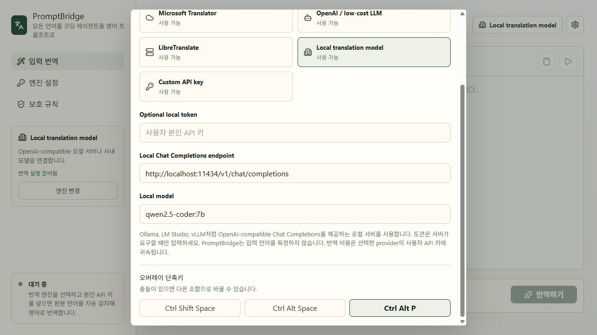
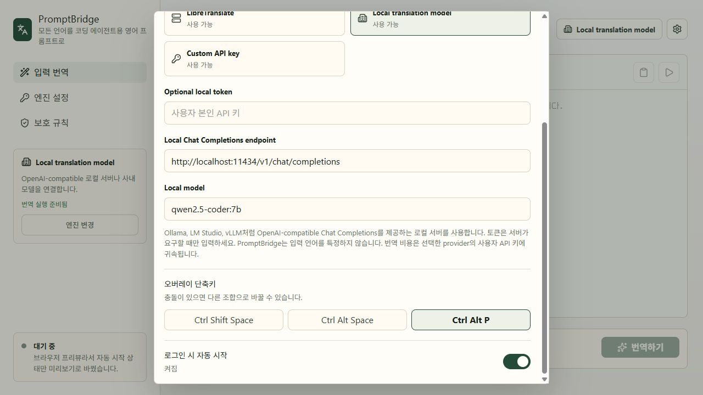

# Overlay Window

## Current Behavior

- Main window: settings and full workspace.
- Overlay window: frameless, always-on-top, hidden on startup, skipped from taskbar.
- Default global shortcut: `Ctrl+Shift+Space` shows and focuses the overlay.
- The settings modal can switch the overlay shortcut to another registered combination, currently `Ctrl+Shift+Space`, `Ctrl+Alt+Space`, or `Ctrl+Alt+P`.
- The settings modal includes a login autostart switch backed by `tauri-plugin-autostart`.
- Overlay keyboard flow:
  - `Ctrl+Enter` translates the current input.
  - `Ctrl+Shift+Enter` no longer injects translated output while paste injection is hidden.
  - `Escape` hides the overlay.
- Tray left click: opens the overlay.
- Tray menu:
  - `Show PromptBridge` opens the main window.
  - `Open Overlay` opens the quick overlay.
  - `Quit` exits the app.

## Frontend Mode

The same React app renders both windows. In Tauri, `getCurrentWindow().label` decides the mode:

- `main`: sidebar + full workspace
- `overlay`: compact titlebar + quick translation workspace

For browser-only visual checks, open:

```text
http://localhost:1420/?overlay=1
```

Shortcut settings screenshot:



Autostart settings screenshot:



## Next UX Checks

- Confirm `Ctrl+Shift+Space` does not conflict with common target apps.
- Confirm the frameless overlay receives focus reliably.
- Confirm the overlay stays above VS Code, Windows Terminal, and browser-based AI tools.
- Revisit paste injection only after there is a more reliable target-app handoff.
