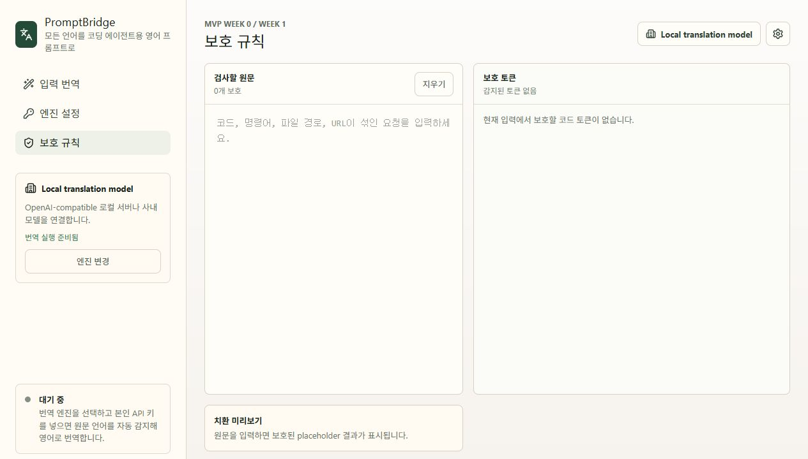

# Prompt Protection

PromptBridge protects coding-sensitive spans before sending text to a translation provider, then restores them after translation.

## Protected Spans

The current protector handles:

- fenced code blocks
- inline code
- URLs
- Windows file paths
- Unix-like relative and absolute paths
- common developer commands such as `git`, `npm`, `cargo`, `docker`, and `kubectl`

Implementation:

- `src/promptProtection.ts`

Tests:

- `src/promptProtection.test.ts`
- `src/App.tsx` protection rules view

## Protection Rules View

The sidebar `보호 규칙` item opens an inspector for the current source prompt. It shows the protected placeholder text and the token list that will be preserved before translation.



Run:

```powershell
npm test
```

## Current Test Coverage

- inline code, commands, paths, and URLs are tokenized separately
- fenced code blocks are protected as one span
- inline command-looking text is not double-protected
- development preview keeps the original source text intact

## Product Note

Protection is intentionally conservative. When a span is ambiguous, the app should prefer preserving developer text over translating it.
