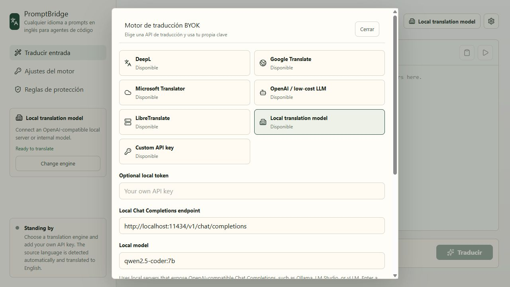

# UI Localization

PromptBridge has a UI language layer separate from translation provider behavior. The app still translates source prompts to English, while menus, settings, labels, and status text can use the user's preferred UI language.

## Supported UI Languages

- English
- Simplified Chinese
- Hindi
- Japanese
- Spanish
- Portuguese
- Korean
- German
- French
- Russian
- Arabic
- Vietnamese
- Indonesian

The registry lives in `src/i18n.ts`. The selected language is stored with `tauri-plugin-store`, with a `localStorage` fallback for browser preview.

## Notes

- English is the default UI language.
- Arabic sets the app container direction to RTL.
- Provider technical names remain stable, while common UI labels and settings text are localized.

